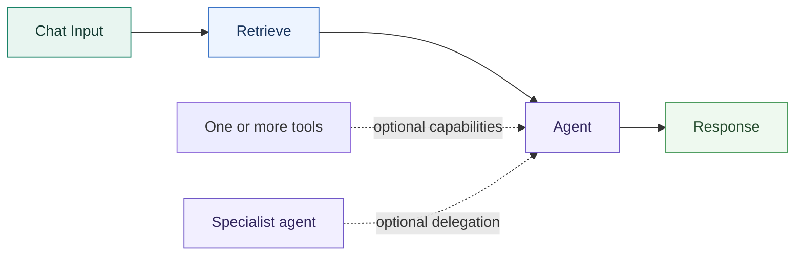
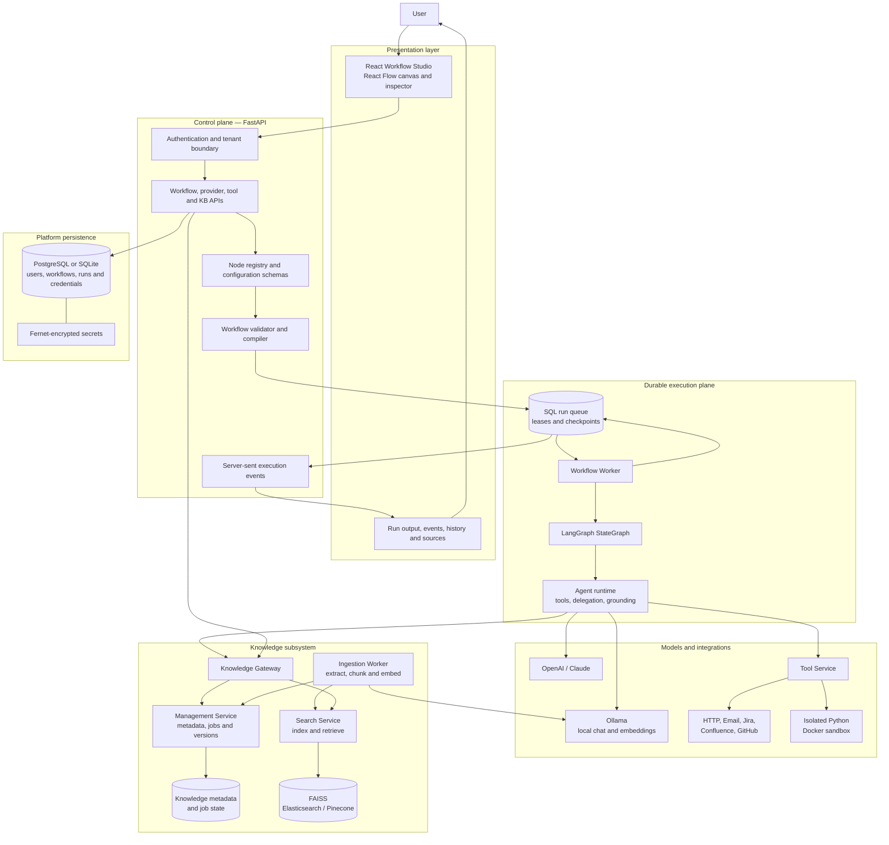
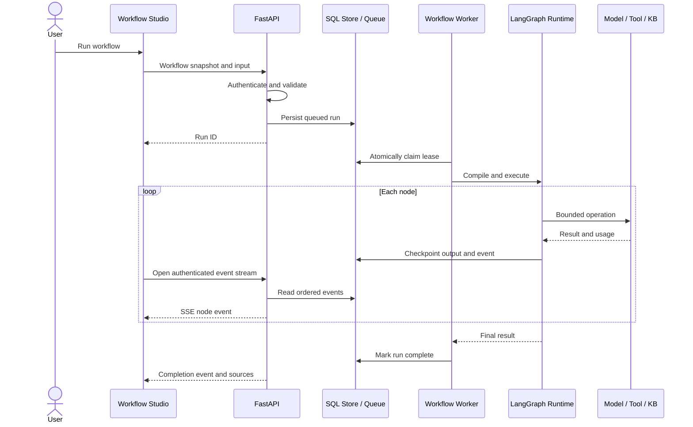
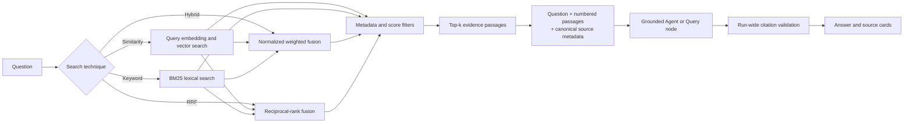

# Relay — Enterprise No-Code Agentic AI Workflow Platform

Relay is a full-stack visual platform for building, validating, and running AI-agent workflows with local or cloud models. It combines a node-based editor, durable LangGraph execution, external tools, versioned knowledge bases, grounded answers, and retrieval evaluation in one local development environment.

> **Current status:** Functional local MVP under active development. Core workflow execution, knowledge ingestion, retrieval, tool calling, authentication, durable write approvals, recovery, and evaluation are implemented. Deployment hardening, team administration, and advanced control flow remain planned work.

## Project at a glance

| Area | Implementation |
| --- | --- |
| Product | Visual no-code editor for agentic AI workflows |
| Frontend | React, TypeScript, React Flow, schema-driven node inspector |
| Backend | FastAPI, LangGraph, SQLAlchemy, durable worker processes |
| Model providers | Local Ollama, OpenAI, Anthropic Claude |
| Knowledge | PDF/DOCX/text ingestion, FAISS, Elasticsearch, Pinecone |
| Retrieval | Semantic similarity, BM25 keyword, weighted hybrid, RRF |
| Tools | HTTP/REST, Email, Jira, Confluence, GitHub, sandboxed Python |
| Reliability | SQL queue, leases, fencing, checkpoints, staged KB publishing and cleanup |
| Security | Authenticated workspaces, encrypted credentials, model allowlists, tenant isolation |
| Quality | Unit/integration tests plus labelled retrieval and grounded-generation evaluations |

## Why I built it

Agent prototypes are easy to demonstrate but difficult to operate safely. A useful platform must validate graph structure, control model and credential access, recover interrupted work, handle uncertainty around external writes, preserve evidence provenance, and remove incomplete knowledge indexes after failure.

Relay explores those engineering requirements as a working product. A user can visually assemble an agent workflow, connect approved models and tools, ingest documents into a named knowledge base, inspect retrieved evidence, and follow every node through execution.

## Example workflow



1. **Chat Input** accepts the user's question.
2. **Retrieve** searches a selected, versioned knowledge base.
3. The **Agent** receives the original question and numbered evidence passages.
4. The Agent may call attached tools or delegate to specialist agents within bounded limits.
5. **Response** validates citation labels against evidence collected across the entire run.

Agent nodes support Planner, Reasoner, Reflection, Critic, Router, Memory, Summarizer, Extraction, and Classification roles. Their four connection directions represent flow input, flow output, attached tools, and specialist-agent delegation.

## System architecture

Relay separates the interactive editor, orchestration API, durable execution runtime, integrations, and knowledge services. Workflow definitions remain portable JSON; execution state and credentials stay in server-controlled storage.



### Architecture responsibilities

| Component | Responsibility |
| --- | --- |
| Workflow Studio | Builds workflows, edits node configuration, displays validation and execution state |
| FastAPI control plane | Authenticates requests and exposes workflow, model, credential, tool, run, and KB APIs |
| Node registry | Defines node contracts so frontend forms and backend validation share one schema source |
| Validator/compiler | Checks bindings and graph rules, then compiles canonical workflow JSON into LangGraph |
| SQL run queue | Persists jobs, node results, ordered events, leases, cancellation, and resume state |
| Workflow worker | Claims durable jobs, renews leases, restores checkpoints, and fences stale workers |
| Agent runtime | Calls models, validates tool arguments, bounds delegation, registers evidence, and enforces citations |
| Tool service | Executes reusable integrations without exposing credentials in workflow JSON |
| Knowledge services | Manage KB versions, ingest documents, build indexes, retrieve passages, and clean failed builds |

## Durable workflow execution

The API does not execute a submitted workflow inside the request. It validates the graph, records an immutable run snapshot, and places the run in a SQL-backed queue. A separate worker claims the run and checkpoints completed node outputs.

Run events are stored as ordered SQL rows, with indexed cursor pagination for history. Budget-capped agents return flagged partial answers or abstain. See the [upgrade procedure and retention limits](docs/run-history-upgrade.md) before updating an existing database.

Operational endpoints: `/api/health` for liveness, `/api/ready` for dependency readiness, and authenticated operator-only `/api/operator/metrics` for time-window metrics. Requests and worker execution share a request ID in structured JSON logs. See [operations and metric definitions](docs/operations.md).




Workers renew 30-second leases. If a worker stops, another worker can claim the expired job and restore successful node results. Execution is intentionally **at least once**: a provider request interrupted before its result is committed may repeat. Workflows that begin an uncertain external write are stopped from automatic resume so the operator can reconcile the remote outcome.

Write-capable HTTP, Email, Jira, Confluence, and GitHub actions pause **before delivery** in `awaiting_approval`. The worker checkpoints the pending action (including nested agent state), saves an immutable request in `run_approvals`, and releases its lease. Open the run in History to review its full method, URL including query parameters, and body—or email sender, recipient, subject, and body. Credentials are stored only in the encrypted execution snapshot and are not included in the review payload.

Approve or reject through the run panel. The client hashes the exact displayed UTF-8 payload; tenant-scoped, rate-limited `POST /api/runs/{id}/approve` and `/reject` require `{approval_id, digest}`. A stale digest is rejected. Approval requeues the paused action without replanning it; completed actions have durable receipts so replaying a decision does not resend. Downstream workflow execution then continues. Changed connections require a new run and review. Rejected, cancelled pending, or expired approvals cannot be bypassed through Resume.

`APPROVAL_TTL_SECONDS` controls expiry (default 86,400 seconds; supported range 1–604,800). Workers sweep pending approvals every five seconds, and both approval and dispatch enforce expiry immediately. The default node setting requires approval for authenticated writes; `approval: true` also enables it locally, and `approval: false` explicitly opts out. Read operations do not pause. This is a same-workspace approval mechanism, not a separate approver-role policy.

Approval is not a remote exactly-once guarantee: a crash or lost response during delivery can leave the outcome unknown. Such writes retain the reconciliation barrier and must be checked in the remote system before starting another attempt. No automatic resend occurs after an uncertain write.


## Knowledge-base architecture

The knowledge subsystem uses separate management, ingestion, and search responsibilities. Builds are staged under new identifiers, and the previous version remains searchable until the replacement is completely indexed and published.


This design prevents partially indexed data from becoming active. Failures remain visible with retry information, while cleanup removes successfully written chunks and vectors from the failed attempt. Rebuilds, document replacements, and embedding changes create a new version rather than modifying the active index in place.

### Retrieval pipeline



Embedding model, chunking strategy, chunk size, and overlap are index-time settings. Search mode, candidate count, top-k, score threshold, metadata filters, fusion constant, vector weight, and optional local reranking are retrieval-time settings. The system keeps retrieval metrics separate from answer-generation metrics because a correct passage can be retrieved and still be reasoned over incorrectly.

The opt-in `section` strategy retains heading paths, inline section headings, and related list/regulatory clauses within paragraph-sized chunks. Heading context is included in both embeddings and lexical search. New search configurations default to 50 candidates. The optional `local_cross_encoder` reranker scores candidates before selecting top-k; its weights must be installed explicitly. Existing knowledge bases need a rebuild to gain heading metadata. See [configuration and evaluation instructions](docs/section-retrieval.md). These features remain subject to the evaluation gates below.

## Platform capabilities

### Visual workflow builder

- Draggable node palette, connections, minimap, zoom, undo/redo, validation, save/load, and JSON import/export.
- Input, Agent, Tool, Retrieval, Control, and Output node categories.
- Backend-provided schemas drive the node inspector.
- Deterministic bindings and validation before execution.
- Conditions select one true/false branch; unsupported cycles and parallel fan-out are rejected.

### Models and agent behavior

- Ollama enables fully local chat and embedding workflows without API credits.
- OpenAI and Claude use encrypted reusable credentials.
- Workspace model allowlists prevent unapproved models from running through saved or imported workflows.
- Agent calls, tool use, and specialist delegation share bounded budgets and depth limits.
- Extraction and Classification roles support schema-validated JSON with one repair attempt.
- Transient provider failures use bounded retry and exponential backoff.

### Knowledge and grounding

- Supported files: PDF, DOCX, TXT, Markdown, CSV, JSON, and HTML.
- Printed English PDFs can use local OCR through Poppler and Tesseract.
- Named knowledge bases support FAISS, Elasticsearch, and Pinecone adapters. Chroma is disabled because the recorded advisories have no patched release; rebuild existing Chroma KBs with FAISS from their preserved original documents.
- Similarity, keyword, hybrid, and RRF retrieval use one search contract.
- Evidence labels are unique across a run, including evidence obtained through tool calls.
- Response nodes reject unknown citation labels and distinguish cited passages from retrieved-only passages.
- Empty retrieval and declared insufficient-evidence answers follow a strict abstention path.

### Tools and safety boundaries

- Reusable HTTP, SMTP Email, Jira, Confluence, and GitHub connections.
- External writes require explicit node-level enablement. With authentication enabled, they also require human approval by default; each write tool has an explicit approval override.
- HTTP adapters reject private, loopback, and metadata addresses and redirects.
- Python executes in an unprivileged Docker container with no network, read-only root, and CPU, memory, process, output, and timeout limits.
- Provider credentials are encrypted and never stored in workflow exports.

## Evaluation and current results

Relay includes labelled corpora and evaluation scripts rather than relying only on visual demos.

### Current accepted result

The release gate accepts the current build on the **product execution path**, not an evaluation-only wrapper. Fifty-three labelled questions over IRS, NIST, OSHA and federal transportation documents; all nine gate checks pass.

| Metric | Result | Gate threshold |
| --- | ---: | ---: |
| Answer substring match | 0.848 (28/33) | ≥ 0.81 |
| Abstention on unanswerable questions | 0.750 (15/20) | ≥ 0.70 |
| False abstention | 0.061 (2/33) | ≤ 0.09 |
| Citation rate | 0.939 (31/33) | ≥ 0.90 |
| First-attempt contract compliance | 0.947 (36/38) | ≥ 0.90 |
| Generation errors | 0 | 0 |

Guard decisions on that run: **38 allow, 15 abstain, 0 skip**. The historical `--answerability-reader` wrapper was absent; the Retrieve node's `answerability_guard` config was enabled, so the measurement describes the shipping path.

- [Fresh report, passage texts and runtime decisions](evals/results/product-guard-fresh-2026-09-21.json)
- [Accepted gate output](evals/results/product-guard-fresh-2026-09-21-check.json)
- [Commit, source/input hashes, model digests and execution provenance](evals/results/product-guard-fresh-2026-09-21-provenance.json)
- [Comparison and remaining failures](evals/results/product-guard-fresh-2026-09-21-comparison.json)
- [Method and limitations](docs/evaluations/2026-09-21-product-guard.md)

**What these numbers are not.** Substring matching does not establish semantic correctness; matching a source document does not establish that it supports the claim; the abstention flag does not establish that abstention was warranted. These are heuristic scores on a calibration corpus, not a promise of 75% abstention on arbitrary documents. Five known unanswerable failures remain, individually tagged in `evals/real/questions-expanded.json`: two temporal mismatches, one that generalises a load-centre example, one that selects an unrelated travel-allowance number, and one that requires driver-specific history absent from the corpus. Those tags are assistant analysis, not independent human labels.

### Thresholds and how they were set

Thresholds were calibrated in commit `33f7da4` **before** the evaluation that now passes them, and were not changed afterwards. Each bar sits one question below the measured operating point, so a single question of run-to-run movement does not fail the gate while two do. The operating point deliberately favours abstention over substring match, because the corpus is regulatory: a confident wrong answer about tax or authentication rules is worse than a refusal. See [the calibration record](docs/evaluations/2026-09-21-grounding-calibration.md).

### Opt-in answerability guard

Retrieve and Query nodes now offer an **Answerability guard** setting, default off. Install the pinned local reader, configure `ANSWERABILITY_MODEL_DIR` on workers, and enable the setting per node. Missing or invalid weights skip with a visible reason; checksum-mismatched weights are never loaded. Decisions appear in run events and operator metrics.

The guard is an opt-in heuristic with known false acceptance and false abstention, not semantic verification. Enabling it is what produced the accepted result above; leaving it off is the prior, less cautious behaviour. See the [operations runbook](docs/operations.md#opt-in-product-answerability-guard) for installation, failure behaviour and metrics.

### How we got here

The accepted result above is the end of a sequence of measured rejections. They are kept because a negative result with reproducible tooling is evidence, and because each explains why the current design is shaped the way it is.


The second corpus uses IRS, NIST, OSHA, and federal transportation documents: 38 labelled questions over approximately 2,900 chunks. In the [September 18 baseline](evals/results/real-generation-recheck-2026-09-18.json), **87.9% of answers contained the expected answer substring**, 78.8% of answerable questions received citations, and 96.2% of answers with citations cited only expected documents (`citation_document_match`). The latter is an answer-level measure, not a percentage of individual passages. Hybrid retrieval contained the expected answer in its top four passages for 87.9% of answerable questions.

Limitations alongside these numbers: **substring matching does not establish semantic correctness; matching a source document does not establish that it supports the claim; the baseline's phrase-based abstention detection can misclassify partial answers.** New evaluations use the runtime's machine-readable abstention flag when available; that flag still does not establish that abstention was warranted.

The subsequent [F11 retrieval experiment](docs/f11-retrieval-calibration-report.md) adds opt-in section-aware chunking and local candidate reranking. Hybrid expected-answer retrieval improved from 87.9% to 90.9%, below the requested 95%; generation substring matches rose from 81.8% to 90.9%. However, unanswerable-question abstention fell from 3/5 to 2/5. **The strengthened safety gate rejects this candidate.** These are substring and abstention-decision measurements, not semantic accuracy or claim-entailment guarantees. Saved artifacts now include complete retrieved passages for offline review. The [answerability safety follow-up](docs/answerability-safety-report.md) expands the suite to 53 questions, persists actual retrieval and reranker scores, and evaluates separate local answerability and NLI classifiers. The experimental reader raises unanswerable abstention from 45% to 75% but reduces substring match from 90.9% to 84.8%; both candidates were rejected under the thresholds in effect for that experiment. The NLI adapter produces 24/24 valid classifications but agrees with only 8/24 assistant labels. The NLI adapter remains offline; valid classification output alone does not establish factual support. The reader is now available as an opt-in product guard under the subsequently calibrated operating point; see the fresh product-path result below.

Detailed methodology and limitations:

- [Test01 retrieval and grounded-generation report](docs/test01-evaluation-report-2026-09-17.md)
- [Production workflow gap analysis](docs/production-gap-analysis.md)
- [Manual employee-handbook findings](docs/manual-test-findings-2026-09-16.md)


### Test01 synthetic policy corpus (historical)

The original synthetic corpus, retained for comparison. It is easier than the real-document corpus: abstention was trivially 1.0 here, which is why thresholds derived from it did not transfer.


The current suite contains 50 questions: 20 verbatim, 20 paraphrased, 5 reasoning, and 5 unanswerable.

| Metric | Latest result |
| --- | ---: |
| Complete expected evidence retrieved | 44/45 answerable questions (97.8%) |
| Answer substring match rate | 40/45 (88.9%) |
| Unsupported questions safely rejected | 5/5 |
| Citation rate on answerable questions | 93.3% |
| Citation document match | 97.6% |
| Runtime errors | 0 |

EmbeddingGemma and Qwen3 Embedding 0.6B were evaluated locally. Fixed-window RRF reached complete evidence coverage on this small corpus, but paragraph chunks produced stronger end-to-end generation. This is why the product does not treat retrieval coverage alone as proof of answer quality.

These figures use automated heuristics: answer scoring checks expected substrings, not semantic correctness; citation scoring checks source documents, not claim entailment; this historical run detected abstentions using phrases, which can misclassify partial answers.

## Verification

Local verification for this change passes:

- Backend tests covering graph execution, authentication, tenant isolation, recovery, grounding, providers, tools, knowledge ingestion, search modes, staged rebuilds, cleanup, and failure handling.
- Frontend tests covering model selection, workflow bindings, save conflicts, import safety, execution state, source cards, and API proxy behavior.
- TypeScript type checking and frontend linting.

Run the checks with:

```bash
.venv/bin/python -m pytest backend/tests -q

cd frontend
npm test
npm run typecheck
npm run lint
npm run build
```

[GitHub Actions](.github/workflows/ci.yml) runs these checks on pushes, pull requests, and a weekly schedule, including `pip-audit` and `npm audit --audit-level=high`. Its first hosted run is pending; local checks do not establish that hosted CI has passed. Real-model evaluation is a separate local gate because it requires the downloaded corpus and Ollama models:

```bash
.venv/bin/python -m scripts.eval_retrieval --corpus evals/real --questions evals/real/questions-expanded.json --chunking section --modes hybrid --candidate-k 50 --reranker local_cross_encoder --generate llama3.1:latest --generate-mode hybrid --product-answerability-guard --out evals/results/real-generation-candidate.json
.venv/bin/python -m scripts.check_grounding_eval evals/results/real-generation-candidate.json
```

The checker returns 0 for acceptance, 1 for a measured rejection, and 2 with `not a generation report` for unusable input. It expects the 53-question safety suite by default; pass `--expected-count 38` for the original suite. It rejects if the full expected run, contract compliance (≥0.90), substring match (≥0.81), false abstention (≤0.09), **abstention on unanswerable questions (≥0.70)**, citation rate (≥0.90), uncited-row count, or error gate fails. Those thresholds were calibrated in `33f7da4`; see [Thresholds and how they were set](#thresholds-and-how-they-were-set) for their provenance and the reasoning behind the operating point.

Rejection is a normal outcome, not a defect. Earlier candidates failed here and are recorded under [How we got here](#how-we-got-here); the [September 18 candidate report](docs/grounding-integrity-verification-2026-09-18.md) failed against the thresholds in effect at the time. Valid JSON and existing citation labels do not establish factual support. Saved generation rows include complete retrieved passage text for offline review.

### Compatibility and data integrity

- Workflow updates must include the `updated_at` returned by the last GET or successful save alongside the workflow fields. Stale or missing tokens return HTTP 409 with `current: {id, workflow, updated_at}`. The editor preserves local edits and offers export and reload.
- Exports containing retired VectorDB nodes or `store` edges receive an actionable migration error: create a named knowledge base and reconnect Retrieve. They are not silently converted or executed.
- Active knowledge-base names are unique within each tenant after whitespace normalization and Unicode case folding. A database unique index enforces the rule. Create and rename conflicts return 409 with the submitted name; deleted names may be reused.
- On startup, existing names are backfilled. If older data already contains duplicates, migration stops and lists the tenant, normalized name, and conflicting IDs. Back up the management database, rename the conflicting active records' `state.name` values to distinct names, and restart. No knowledge base or document is automatically deleted or renamed. There is currently no separate KB-import endpoint; restored legacy databases use this same migration.

## Run locally

### Requirements

- Python 3.12+
- Node.js 22.13+
- Ollama for local models and embeddings
- Docker for the sandboxed Python tool
- Poppler and Tesseract for scanned-PDF OCR
- PostgreSQL is optional; SQLite is the local default

### Installation

```bash
git clone https://github.com/SoumithReddy6/Enterprise-No-Code-Agentic-AI-Workflow-Platform.git
cd Enterprise-No-Code-Agentic-AI-Workflow-Platform

python3 -m venv .venv
.venv/bin/pip install -r backend/requirements.txt

cd frontend
npm ci
cd ..
```

For PDF OCR on macOS:

```bash
brew install poppler tesseract
```

Download local models, for example:

```bash
ollama pull llama3.1
ollama pull embeddinggemma
ollama pull qwen3-embedding:0.6b
```

Start the complete local platform:

```bash
python3 scripts/dev.py
```

- Workflow Studio: `http://127.0.0.1:3000`
- API documentation: `http://127.0.0.1:8000/docs`

Registration defaults to `AUTH_REGISTRATION_MODE=closed`: the first account can claim the local workspace; later registrations receive 403. `invite` requires an expiring, single-use token, and `open` is available for deliberate local multi-user testing. Login budgets are stored per account and IP: escalating cooldown after five attempts, then a 15-minute lockout after ten. The cooldown applies to correct passwords too; existing sessions remain usable. See [security configuration, recovery, and verification](docs/security-hardening.md) for operator commands and proxy constraints.

The launcher starts the editor, API, workflow worker, ingestion worker, management service, and search service. Create an account on first launch, enable an installed Ollama model in **Providers**, configure an Agent node, and run the starter workflow.

Configuration can be supplied through a root `.env` file. See [.env.example](.env.example). The `.data` directory, credentials, local databases, index files, and environment files are excluded from Git.

## Current status and roadmap

| Implemented | Next engineering work | Later platform work |
| --- | --- | --- |
| Visual workflow editor, section-aware chunking, and durable write approvals | Remaining regulatory retrieval misses | Advanced control flow |
| Local/cloud providers and opt-in local reranking | Unanswerable-question safety regression | Action ledger and reconciliation |
| Agent roles and specialist delegation | Structured numeric-policy verifier | Published workflow versions |
| Named, versioned knowledge bases | Improved retrieval test lab | Webhooks and scheduled triggers |
| Four retrieval techniques | Browser interaction and visual QA | Parallel joins and bounded loops |
| Durable queued execution | Per-tenant budgets | Team roles and invitations |
| Grounding and citation validation | Deployment health/readiness | Audit, retention, and PII controls |
| Tool integrations and sandboxed Python | Real remote-adapter integration tests | Managed production deployment |

Relay is currently intended for local development and portfolio demonstration. It should remain bound to loopback until TLS, managed secrets, database migrations, backups, operational telemetry, load testing, and deployment controls are completed.

## Engineering decisions and boundaries

- Canonical workflow JSON is stored alongside the compiled graph so workflows remain portable and preserve canvas layout.
- Node contracts are registered once and shared with frontend configuration forms.
- The relational database also acts as the durable queue; Redis is not required for the local architecture.
- Knowledge rebuilds publish atomically, keeping the previous version active until the new version passes verification.
- Embedding digests are pinned because vectors from different model versions are not interchangeable.
- Citation validation proves source provenance, not full semantic entailment; claim-level verification remains ongoing research work.
- Runs snapshot their workflow, but immutable published workflow versions and full deployment management are future work.
- SSE currently streams node lifecycle events rather than model tokens.
- Graphs are capped at 100 nodes and one attempt has a 120-second execution limit.


## Repository guide

| Path | Purpose |
| --- | --- |
| `frontend/components/workflow-editor.tsx` | Visual workflow-editor coordination |
| `frontend/lib/workflow.ts` | Client workflow types and API boundary |
| `backend/app/registry.py` | Node contracts and runtime handlers |
| `backend/app/compiler.py` | Workflow validation and LangGraph compilation |
| `backend/app/worker.py` | Durable workflow worker |
| `backend/app/agent_runtime.py` | Tool calling, delegation, grounding, and structured output |
| `backend/app/kb/` | Knowledge management, ingestion, search, and RPC services |
| `scripts/eval_retrieval.py` | Retrieval and grounded-generation evaluation harness |
| `evals/` | Labelled synthetic and real-document evaluation corpora |
| `docs/` | Evaluation reports and production gap analysis |

## License

No open-source license has been selected yet. All rights are reserved by the repository owner unless a license is added.
