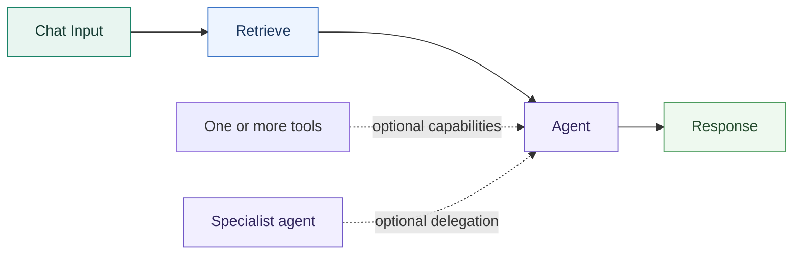
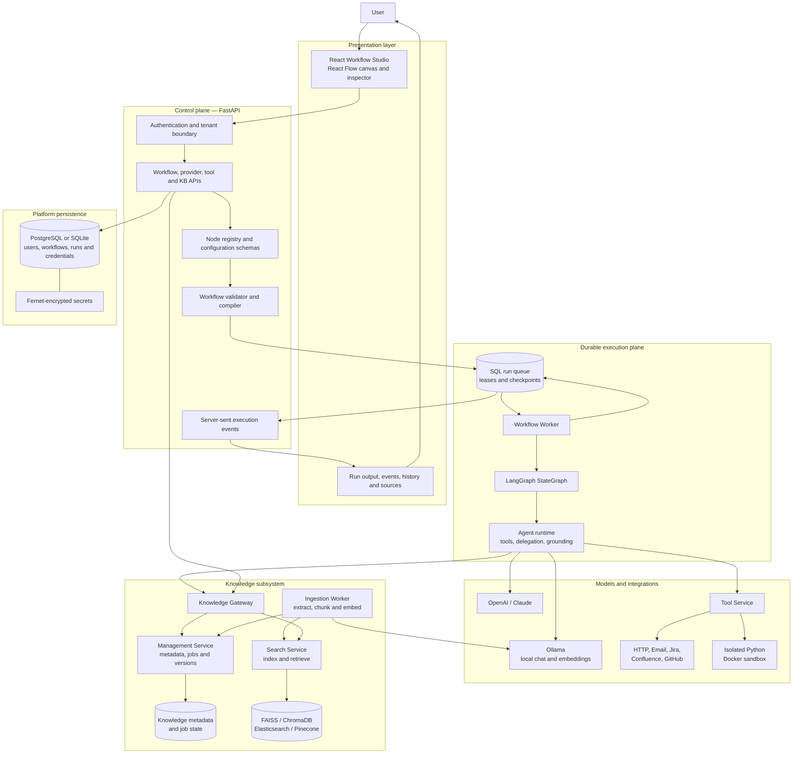
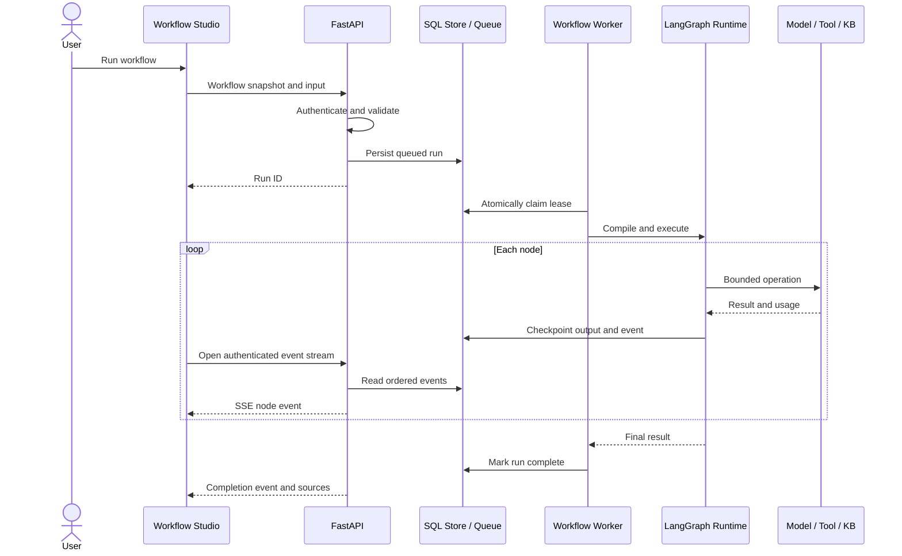
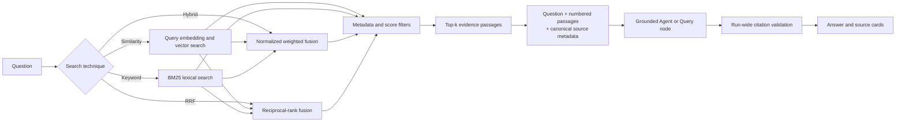

# Relay — Enterprise No-Code Agentic AI Workflow Platform

Relay is a full-stack visual platform for building, validating, and running AI-agent workflows with local or cloud models. It combines a node-based editor, durable LangGraph execution, external tools, versioned knowledge bases, grounded answers, and retrieval evaluation in one local development environment.

> **Current status:** Functional local MVP under active development. Core workflow execution, knowledge ingestion, retrieval, tool calling, authentication, recovery, and evaluation are implemented. Deployment hardening, team administration, human approval workflows, and advanced control flow remain planned work.

## Project at a glance

| Area | Implementation |
| --- | --- |
| Product | Visual no-code editor for agentic AI workflows |
| Frontend | React, TypeScript, React Flow, schema-driven node inspector |
| Backend | FastAPI, LangGraph, SQLAlchemy, durable worker processes |
| Model providers | Local Ollama, OpenAI, Anthropic Claude |
| Knowledge | PDF/DOCX/text ingestion, FAISS, ChromaDB, Elasticsearch, Pinecone |
| Retrieval | Semantic similarity, BM25 keyword, weighted hybrid, RRF |
| Tools | HTTP/REST, Email, Jira, Confluence, GitHub, sandboxed Python |
| Reliability | SQL queue, leases, fencing, checkpoints, staged KB publishing and cleanup |
| Security | Authenticated workspaces, encrypted credentials, model allowlists, tenant isolation |
| Quality | Unit/integration tests plus labelled retrieval and grounded-generation evaluations |

## Why I built it

Agent prototypes are easy to demonstrate but difficult to operate safely. A useful platform must validate graph structure, control model and credential access, recover interrupted work, handle uncertainty around external writes, preserve evidence provenance, and remove incomplete knowledge indexes after failure.

Relay explores those engineering requirements as a working product. A user can visually assemble an agent workflow, connect approved models and tools, ingest documents into a named knowledge base, inspect retrieved evidence, and follow every node through execution.

## Example workflow



1. **Chat Input** accepts the user's question.
2. **Retrieve** searches a selected, versioned knowledge base.
3. The **Agent** receives the original question and numbered evidence passages.
4. The Agent may call attached tools or delegate to specialist agents within bounded limits.
5. **Response** validates citation labels against evidence collected across the entire run.

Agent nodes support Planner, Reasoner, Reflection, Critic, Router, Memory, Summarizer, Extraction, and Classification roles. Their four connection directions represent flow input, flow output, attached tools, and specialist-agent delegation.

## System architecture

Relay separates the interactive editor, orchestration API, durable execution runtime, integrations, and knowledge services. Workflow definitions remain portable JSON; execution state and credentials stay in server-controlled storage.



### Architecture responsibilities

| Component | Responsibility |
| --- | --- |
| Workflow Studio | Builds workflows, edits node configuration, displays validation and execution state |
| FastAPI control plane | Authenticates requests and exposes workflow, model, credential, tool, run, and KB APIs |
| Node registry | Defines node contracts so frontend forms and backend validation share one schema source |
| Validator/compiler | Checks bindings and graph rules, then compiles canonical workflow JSON into LangGraph |
| SQL run queue | Persists jobs, node results, ordered events, leases, cancellation, and resume state |
| Workflow worker | Claims durable jobs, renews leases, restores checkpoints, and fences stale workers |
| Agent runtime | Calls models, validates tool arguments, bounds delegation, registers evidence, and enforces citations |
| Tool service | Executes reusable integrations without exposing credentials in workflow JSON |
| Knowledge services | Manage KB versions, ingest documents, build indexes, retrieve passages, and clean failed builds |

## Durable workflow execution

The API does not execute a submitted workflow inside the request. It validates the graph, records an immutable run snapshot, and places the run in a SQL-backed queue. A separate worker claims the run and checkpoints completed node outputs.



Workers renew 30-second leases. If a worker stops, another worker can claim the expired job and restore successful node results. Execution is intentionally **at least once**: a provider request interrupted before its result is committed may repeat. Workflows that begin an uncertain external write are stopped from automatic resume so the operator can reconcile the remote outcome.

## Knowledge-base architecture

The knowledge subsystem uses separate management, ingestion, and search responsibilities. Builds are staged under new identifiers, and the previous version remains searchable until the replacement is completely indexed and published.

```mermaid
flowchart LR
    CONFIG["Create KB configuration"] --> UPLOAD["Upload one or more documents"]
    UPLOAD --> META["Create document metadata<br/>and durable ingestion job"]
    META --> CLAIM["Ingestion worker claims lease"]
    CLAIM --> EXTRACT["Extract text / OCR"]
    EXTRACT --> CHUNK["Chunk by fixed window<br/>or paragraph"]
    CHUNK --> EMBED{"Embedding model selected?"}
    EMBED -- Yes --> VECTORS["Create Ollama embeddings"]
    EMBED -- No --> KEYWORD["Build keyword postings"]
    VECTORS --> STAGE["Build isolated staging segment"]
    KEYWORD --> STAGE
    STAGE --> VERIFY["Verify counts, dimensions<br/>and ownership"]
    VERIFY --> PUBLISH["Atomically publish KB version"]
    PUBLISH --> ACTIVE["Active searchable version"]

    EXTRACT -. failure .-> FAIL["Record failed attempt"]
    CHUNK -. failure .-> FAIL
    VECTORS -. failure .-> FAIL
    STAGE -. failure .-> FAIL
    VERIFY -. failure .-> FAIL
    FAIL --> CLEANUP["Durable cleanup queue"]
    CLEANUP --> DELETE["Delete partial chunks,<br/>vectors and index segment"]
    DELETE --> RETRY["Retry or replace document"]
```



This design prevents partially indexed data from becoming active. Failures remain visible with retry information, while cleanup removes successfully written chunks and vectors from the failed attempt. Rebuilds, document replacements, and embedding changes create a new version rather than modifying the active index in place.

### Retrieval pipeline



Embedding model, chunking strategy, chunk size, and overlap are index-time settings. Search mode, candidate count, top-k, score threshold, metadata filters, fusion constant, and vector weight are retrieval-time settings. The system keeps retrieval metrics separate from answer-generation metrics because a correct passage can be retrieved and still be reasoned over incorrectly.

## Platform capabilities

### Visual workflow builder

- Draggable node palette, connections, minimap, zoom, undo/redo, validation, save/load, and JSON import/export.
- Input, Agent, Tool, Retrieval, Control, and Output node categories.
- Backend-provided schemas drive the node inspector.
- Deterministic bindings and validation before execution.
- Conditions select one true/false branch; unsupported cycles and parallel fan-out are rejected.

### Models and agent behavior

- Ollama enables fully local chat and embedding workflows without API credits.
- OpenAI and Claude use encrypted reusable credentials.
- Workspace model allowlists prevent unapproved models from running through saved or imported workflows.
- Agent calls, tool use, and specialist delegation share bounded budgets and depth limits.
- Extraction and Classification roles support schema-validated JSON with one repair attempt.
- Transient provider failures use bounded retry and exponential backoff.

### Knowledge and grounding

- Supported files: PDF, DOCX, TXT, Markdown, CSV, JSON, and HTML.
- Printed English PDFs can use local OCR through Poppler and Tesseract.
- Named knowledge bases support FAISS, ChromaDB, Elasticsearch, and Pinecone adapters.
- Similarity, keyword, hybrid, and RRF retrieval use one search contract.
- Evidence labels are unique across a run, including evidence obtained through tool calls.
- Response nodes reject unknown citation labels and distinguish cited passages from retrieved-only passages.
- Empty retrieval and declared insufficient-evidence answers follow a strict abstention path.

### Tools and safety boundaries

- Reusable HTTP, SMTP Email, Jira, Confluence, and GitHub connections.
- External writes require explicit node-level enablement.
- HTTP adapters reject private, loopback, and metadata addresses and redirects.
- Python executes in an unprivileged Docker container with no network, read-only root, and CPU, memory, process, output, and timeout limits.
- Provider credentials are encrypted and never stored in workflow exports.

## Evaluation and current results

Relay includes labelled corpora and evaluation scripts rather than relying only on visual demos.

### Test01 synthetic policy corpus

The current suite contains 50 questions: 20 verbatim, 20 paraphrased, 5 reasoning, and 5 unanswerable.

| Metric | Latest result |
| --- | ---: |
| Complete expected evidence retrieved | 44/45 answerable questions (97.8%) |
| Required-answer match | 40/45 (88.9%) |
| Unsupported questions safely rejected | 5/5 |
| Citation rate on answerable questions | 93.3% |
| Cited-document accuracy | 97.6% |
| Runtime errors | 0 |

EmbeddingGemma and Qwen3 Embedding 0.6B were evaluated locally. Fixed-window RRF reached complete evidence coverage on this small corpus, but paragraph chunks produced stronger end-to-end generation. This is why the product does not treat retrieval coverage alone as proof of answer quality.

### Real-document corpus

The second corpus uses IRS, NIST, OSHA, and federal transportation documents: 38 labelled questions over approximately 2,900 chunks. RRF retrieved the answer passage in the top four for 90.9% of answerable questions. Grounded generation reached 87.9% answer accuracy and was correct whenever the required answer passage was retrieved in that run.

Detailed methodology and limitations:

- [Test01 retrieval and grounded-generation report](docs/test01-evaluation-report-2026-09-17.md)
- [Production workflow gap analysis](docs/production-gap-analysis.md)
- [Manual employee-handbook findings](docs/manual-test-findings-2026-09-16.md)

## Verification

The current repository passes:

- **186 backend tests** covering graph execution, authentication, tenant isolation, recovery, grounding, providers, tools, knowledge ingestion, search modes, staged rebuilds, cleanup, and failure handling.
- **19 frontend tests** covering model selection, workflow bindings, save races, import safety, execution state, source cards, and API proxy behavior.
- TypeScript type checking and frontend linting.

Run the checks with:

```bash
.venv/bin/python -m pytest backend/tests -q

cd frontend
npm test
npm run typecheck
npm run lint
```

## Run locally

### Requirements

- Python 3.12+
- Node.js 22.13+
- Ollama for local models and embeddings
- Docker for the sandboxed Python tool
- Poppler and Tesseract for scanned-PDF OCR
- PostgreSQL is optional; SQLite is the local default

### Installation

```bash
git clone https://github.com/SoumithReddy6/Enterprise-No-Code-Agentic-AI-Workflow-Platform.git
cd Enterprise-No-Code-Agentic-AI-Workflow-Platform

python3 -m venv .venv
.venv/bin/pip install -r backend/requirements.txt

cd frontend
npm ci
cd ..
```

For PDF OCR on macOS:

```bash
brew install poppler tesseract
```

Download local models, for example:

```bash
ollama pull llama3.1
ollama pull embeddinggemma
ollama pull qwen3-embedding:0.6b
```

Start the complete local platform:

```bash
python3 scripts/dev.py
```

- Workflow Studio: `http://127.0.0.1:3000`
- API documentation: `http://127.0.0.1:8000/docs`

The launcher starts the editor, API, workflow worker, ingestion worker, management service, and search service. Create an account on first launch, enable an installed Ollama model in **Providers**, configure an Agent node, and run the starter workflow.

Configuration can be supplied through a root `.env` file. See [.env.example](.env.example). The `.data` directory, credentials, local databases, index files, and environment files are excluded from Git.

## Current status and roadmap

| Implemented | Next engineering work | Later platform work |
| --- | --- | --- |
| Visual workflow editor | Section-aware chunking | Durable human approval nodes |
| Local and cloud model providers | Candidate reranking | Action ledger and reconciliation |
| Agent roles and specialist delegation | Structured numeric-policy verifier | Published workflow versions |
| Named, versioned knowledge bases | Improved retrieval test lab | Webhooks and scheduled triggers |
| Four retrieval techniques | Browser interaction and visual QA | Parallel joins and bounded loops |
| Durable queued execution | Per-tenant budgets | Team roles and invitations |
| Grounding and citation validation | Deployment health/readiness | Audit, retention, and PII controls |
| Tool integrations and sandboxed Python | Real remote-adapter integration tests | Managed production deployment |

Relay is currently intended for local development and portfolio demonstration. It should remain bound to loopback until TLS, managed secrets, database migrations, backups, operational telemetry, load testing, and deployment controls are completed.

## Engineering decisions and boundaries

- Canonical workflow JSON is stored alongside the compiled graph so workflows remain portable and preserve canvas layout.
- Node contracts are registered once and shared with frontend configuration forms.
- The relational database also acts as the durable queue; Redis is not required for the local architecture.
- Knowledge rebuilds publish atomically, keeping the previous version active until the new version passes verification.
- Embedding digests are pinned because vectors from different model versions are not interchangeable.
- Citation validation proves source provenance, not full semantic entailment; claim-level verification remains ongoing research work.
- Runs snapshot their workflow, but immutable published workflow versions and full deployment management are future work.
- SSE currently streams node lifecycle events rather than model tokens.
- Graphs are capped at 100 nodes and one attempt has a 120-second execution limit.


## Repository guide

| Path | Purpose |
| --- | --- |
| `frontend/components/workflow-editor.tsx` | Visual workflow-editor coordination |
| `frontend/lib/workflow.ts` | Client workflow types and API boundary |
| `backend/app/registry.py` | Node contracts and runtime handlers |
| `backend/app/compiler.py` | Workflow validation and LangGraph compilation |
| `backend/app/worker.py` | Durable workflow worker |
| `backend/app/agent_runtime.py` | Tool calling, delegation, grounding, and structured output |
| `backend/app/kb/` | Knowledge management, ingestion, search, and RPC services |
| `scripts/eval_retrieval.py` | Retrieval and grounded-generation evaluation harness |
| `evals/` | Labelled synthetic and real-document evaluation corpora |
| `docs/` | Evaluation reports and production gap analysis |

## License

No open-source license has been selected yet. All rights are reserved by the repository owner unless a license is added.
