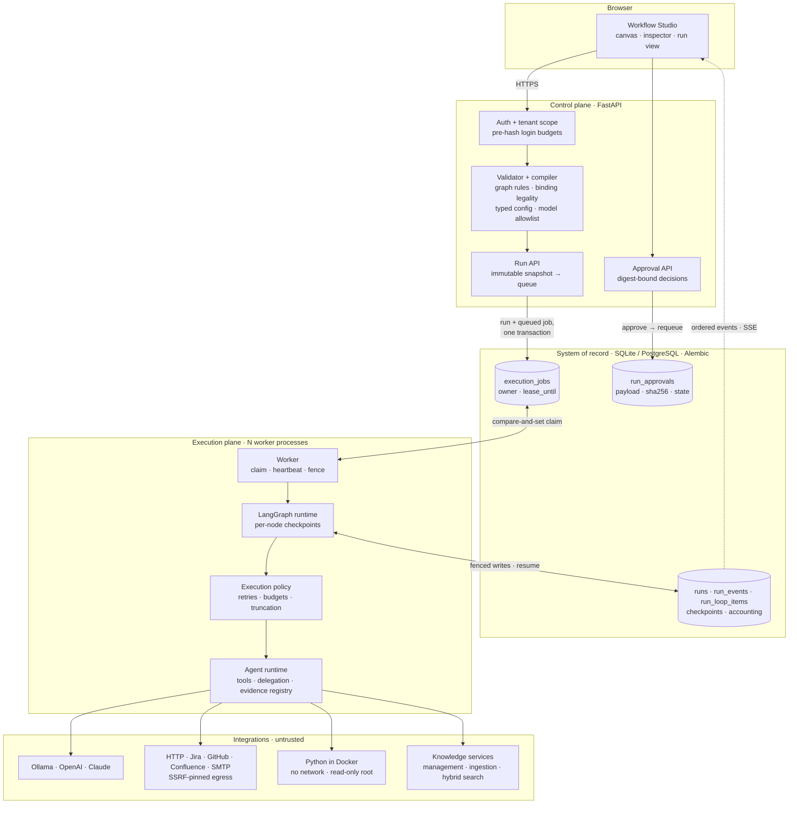
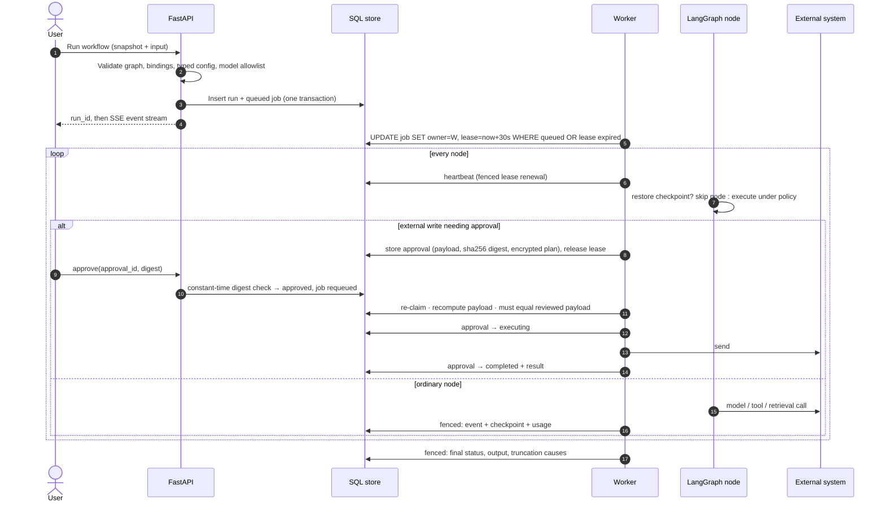
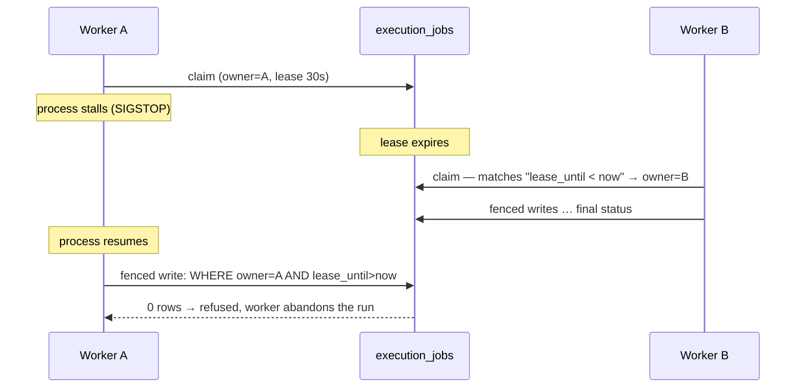
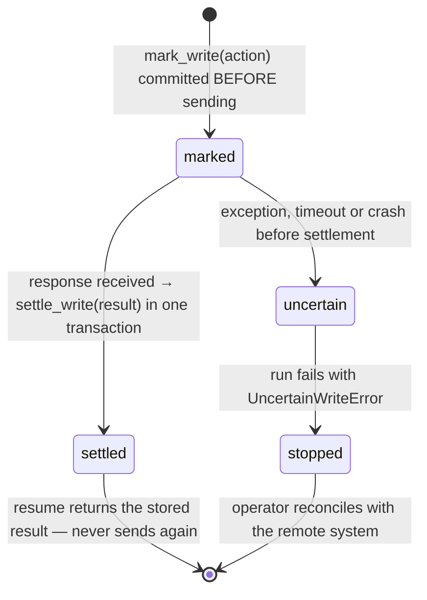
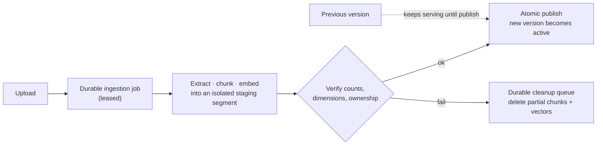
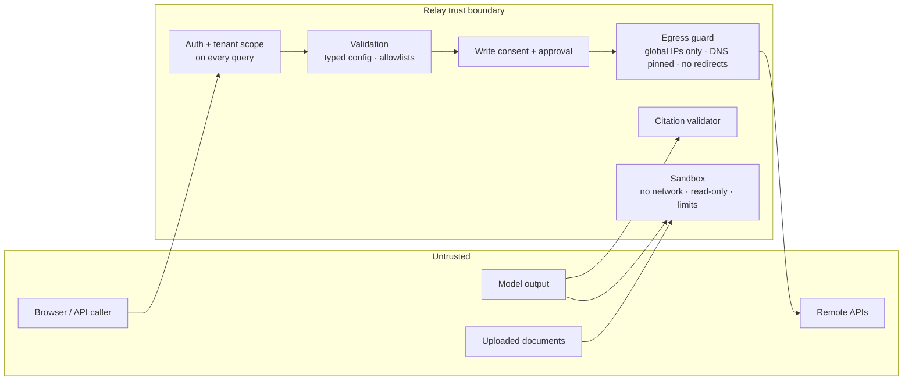
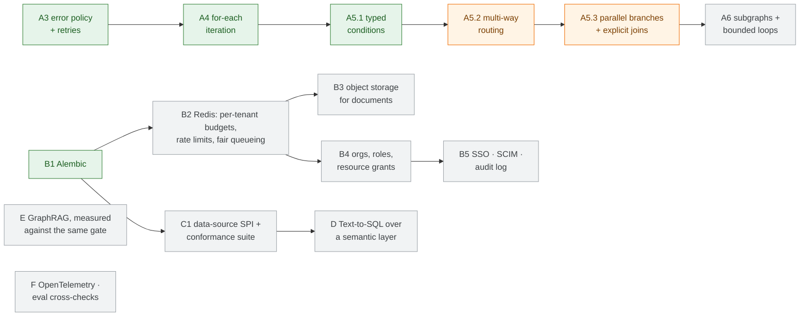

# Relay

**A local-first platform for building and running AI-agent workflows that survive crashes, never send an external write twice, and refuse to guess.**

You draw a workflow on a canvas: a chat input, retrieval over your documents, agents with tools and specialist sub-agents, conditions, loops, approvals and a response. Relay compiles it to a LangGraph state machine and runs it on durable workers. The interesting part is not the canvas. It is what happens when things go wrong: a worker dies mid-loop, two workers think they own the same run, a Jira write times out after the server accepted it, a loop's results outgrow the database row, or a model invents a citation.

This README is about how the system is designed for those cases.

| | |
| --- | --- |
| **Status** | Working local platform, single workspace per account. Intended for loopback use until the deployment and identity work below lands. |
| **Stack** | React + React Flow · FastAPI · LangGraph · SQLAlchemy on SQLite or PostgreSQL · Alembic · Ollama, OpenAI, Claude · FAISS, Elasticsearch, Pinecone · Docker sandbox |
| **Verification** | 1,055 backend tests run under five hash seeds · 72 frontend unit tests + 10 Chromium tests · 19 deployed-process production scenarios · 17 live-model workflows · PostgreSQL conformance · all five GitHub Actions jobs green · a 53-question grounding gate with thresholds fixed before measurement |

---

## 1. System architecture


```mermaid
flowchart TB
    subgraph CLIENT["Browser"]
        STUDIO["Workflow Studio<br/>canvas · inspector · run view"]
    end

    subgraph CONTROL["Control plane · FastAPI"]
        direction LR
        AUTHN["Auth + tenant scope<br/>pre-hash login budgets"]
        VALIDATE["Validator + compiler<br/>graph rules · binding legality<br/>typed config · model allowlist"]
        RUNAPI["Run API<br/>immutable snapshot → queue"]
        APPROVE["Approval API<br/>digest-bound decisions"]
        AUTHN --> VALIDATE --> RUNAPI
    end

    subgraph DATA["System of record · SQLite / PostgreSQL · Alembic"]
        direction LR
        JOBS[("execution_jobs<br/>owner · lease_until")]
        RUNS[("runs · run_events · run_loop_items<br/>checkpoints · accounting")]
        APPR[("run_approvals<br/>payload · sha256 · state")]
    end

    subgraph EXEC["Execution plane · N worker processes"]
        direction LR
        WORKER["Worker<br/>claim · heartbeat · fence"]
        GRAPH["LangGraph runtime<br/>per-node checkpoints"]
        POLICY["Execution policy<br/>retries · budgets · truncation"]
        AGENT["Agent runtime<br/>tools · delegation · evidence registry"]
        WORKER --> GRAPH --> POLICY --> AGENT
    end

    subgraph EDGE["Integrations · untrusted"]
        direction LR
        MODELS["Ollama · OpenAI · Claude"]
        TOOLS["HTTP · Jira · GitHub · Confluence · SMTP<br/>SSRF-pinned egress"]
        SANDBOX["Python in Docker<br/>no network · read-only root"]
        KB["Knowledge services<br/>management · ingestion · hybrid search"]
    end

    STUDIO -->|"HTTPS"| AUTHN
    STUDIO --> APPROVE
    RUNAPI -->|"run + queued job,<br/>one transaction"| JOBS
    APPROVE -->|"approve → requeue"| APPR
    JOBS <-->|"compare-and-set claim"| WORKER
    GRAPH <-->|"fenced writes · resume"| RUNS
    AGENT --> MODELS & TOOLS & SANDBOX & KB
    RUNS -.->|"ordered events · SSE"| STUDIO
```

**Design rules everything else follows**

1. **The database is the only source of truth.** Workers hold no state that matters. Anything needed to resume is committed before it is relied on.
2. **Every worker write is fenced.** A write happens only inside a transaction that proves the writer still owns the run's lease.
3. **Record intent before side effects.** An external write is marked *before* it is sent and settled *with* its result in the same transaction.
4. **Fail closed, and say why.** Missing data, unverifiable state, uncomparable values and untrusted audit reports are errors with reasons, never a quiet default.
5. **Incomplete is a first-class result.** Anything cut short by a cap, a budget or a truncated API response is reported with its cause, never presented as complete.

### Life of a run


```mermaid
sequenceDiagram
    autonumber
    actor U as User
    participant API as FastAPI
    participant DB as SQL store
    participant W as Worker
    participant G as LangGraph node
    participant X as External system

    U->>API: Run workflow (snapshot + input)
    API->>API: Validate graph, bindings, typed config, model allowlist
    API->>DB: Insert run + queued job (one transaction)
    API-->>U: run_id, then SSE event stream
    W->>DB: UPDATE job SET owner=W, lease=now+30s WHERE queued OR lease expired
    loop every node
        W->>DB: heartbeat (fenced lease renewal)
        G->>G: restore checkpoint? skip node : execute under policy
        alt external write needing approval
            W->>DB: store approval (payload, sha256 digest, encrypted plan), release lease
            U->>API: approve(approval_id, digest)
            API->>DB: constant-time digest check → approved, job requeued
            W->>DB: re-claim · recompute payload · must equal reviewed payload
            W->>DB: approval → executing
            W->>X: send
            W->>DB: approval → completed + result
        else ordinary node
            G->>X: model / tool / retrieval call
            W->>DB: fenced: event + checkpoint + usage
        end
    end
    W->>DB: fenced: final status, output, truncation causes
```

---

## 2. Production problems Relay is designed for

These are failure modes of shared, long-running, side-effecting systems, the kind that do not show up in a single-user demo. For each one: what goes wrong, how Relay handles it, and the evidence. Scenario IDs (S01–S19) refer to the [deployed-process scenario gate](docs/production-scenario-testing.md), which runs a real API process, real worker processes and a real HTTP receiver.

### 2.1 Two workers believe they own the same run

**What goes wrong.** A worker pauses: a GC stall, a laptop sleep, a `SIGSTOP`, a network partition. Its lease expires, and a second worker claims the run and finishes it. Then the first worker wakes up and keeps writing events, checkpoints and a final status over the finished run.

**Design.** Claiming is a compare-and-set: `UPDATE execution_jobs SET owner=?, lease_until=? WHERE run_id=? AND (status='queued' OR lease_until < now)`. Only one claimant's update matches. Every later write from a worker goes through a **fence**: an `UPDATE … WHERE owner = me AND status='running' AND lease_until > now` in the *same transaction* as the write. If the fence matches no row, the write is refused and the worker stops. Heartbeats renew the 30-second lease through the same fence.


```mermaid
sequenceDiagram
    participant A as Worker A
    participant DB as execution_jobs
    participant B as Worker B
    A->>DB: claim (owner=A, lease 30s)
    Note over A: process stalls (SIGSTOP)
    Note over DB: lease expires
    B->>DB: claim — matches "lease_until < now" → owner=B
    B->>DB: fenced writes … final status
    Note over A: process resumes
    A->>DB: fenced write: WHERE owner=A AND lease_until>now
    DB-->>A: 0 rows → refused, worker abandons the run
```

**Evidence.** PostgreSQL CI job: a worker is stopped past a real lease, a replacement completes the run, the stale worker resumes, and all five of its stale operations are refused, leaving the final run unchanged. Separately, four worker processes on 50 runs produced 50 unique claims and no duplicated item rows.

### 2.2 A worker dies mid-run, or mid-loop

**What goes wrong.** A run with paid model calls and a 30-item batch dies at item 17. Restarting from scratch repeats paid calls and side effects; restarting from memory is impossible because the process is gone.

**Design.** Every node's result is committed as a checkpoint in the same fenced transaction as its success event. On re-claim, completed nodes restore from checkpoints instead of running. Loops store **one row per item** in `run_loop_items`, committed with that item's event. A crash at item 17 therefore resumes at item 18, and items 1–16 are neither re-run nor re-charged.

**Evidence.**
- S15: the worker exits right after an item's SQL commit, and real lease expiry hands the run to a new worker without repeating the completed write.
- PostgreSQL CI: `SIGKILL` mid-loop; committed items are not repeated, and checkpoints match an uninterrupted run.
- Honest boundary: a *read* in flight at the moment of the kill has an unknown outcome and is retried once, and that retry is charged. Relay promises "no duplicate writes", not "every call exactly once".

### 2.3 "Did the external write happen?"

**What goes wrong.** Relay sends a POST to create a Jira issue, and the connection drops. The remote side may have created the issue. Retrying risks a duplicate ticket or a second customer email; skipping risks losing the action. Most systems quietly pick one.

**Design.** Writes follow a three-state protocol per action, not per node:


```mermaid
stateDiagram-v2
    [*] --> marked: mark_write(action) committed BEFORE sending
    marked --> settled: response received → settle_write(result) in one transaction
    marked --> uncertain: exception, timeout or crash before settlement
    settled --> [*]: resume returns the stored result — never sends again
    uncertain --> stopped: run fails with UncertainWriteError
    stopped --> [*]: operator reconciles with the remote system
```

- External writes are **never retried**. Validation rejects a retry policy on any write node, including write tools attached to agents and loop bodies.
- `on_error: continue` and `route` **cannot hide uncertainty**: an uncertain write stops the run even inside a recovery path (S03, S04).
- Resuming a run whose write is uncertain is refused with HTTP 409.
- Uncertainty is reserved for the send itself. The request is built and checked *before* the marker is written, so a refusal at that stage, such as missing write consent, a mismatched connection or a number JSON cannot carry exactly, is an ordinary failure with nothing to reconcile. Address checks happen at connect time and stay on the uncertain side.

**Evidence.** S16: the worker is killed *after the receiver accepted the write but before the response arrived*. The receiver logged exactly one request after recovery, and resume was refused.

### 2.4 A human approves one thing, and something else gets sent

**What goes wrong.** An operator approves "send this reply to customer A". Between approval and execution, the connection's endpoint is edited, the upstream data changes on resume, or a stale browser tab approves an older payload.

**Design.**
- The approval stores the exact prepared payload, its SHA-256 digest over canonical JSON, and the execution plan encrypted at rest.
- A decision must quote the digest, which is checked with a constant-time compare. Approvals expire and are rate-limited per tenant.
- One approval exists per (run, action) through a unique constraint, so a double-click is idempotent.
- On resume the worker **recomputes** the payload and connection and refuses to send if either differs from what was reviewed.
- An approval in the `executing` state at resume is treated as uncertain (§2.3).
- The action-budget reservation made before the pause is recorded in the same transaction that releases the lease, so the approved execution is not charged twice.

**Evidence.**
- S01: a wrong digest returns 409 and nothing is sent; a duplicate approval is a no-op.
- S14: changing the destination after review blocks the write.
- S02: rejection is terminal and cannot be resumed.
- S05: a worker restart between batch approvals repeats nothing.

### 2.5 Loop results that outgrow the database

**What goes wrong.** The first loop implementation stored all item results inside the run's checkpoint JSON. Each item rewrote a growing blob, so write volume grew quadratically, and a 100-item batch of large tool responses produced multi-megabyte rewrites per item.

**Design.**
- Item results live in their own rows.
- The run checkpoint keeps only a compact marker `{stored_in, count, sha256}`. When a run is loaded, the item rows must match that marker exactly, with no missing or extra rows; otherwise the loop is marked unavailable and resume refuses to continue past it, rather than proceeding with a silently partial result.
- Retained values are capped at 1 MB per loop. Beyond that, values are dropped but statuses kept, and the drop is reported as incomplete work.
- Event previews are capped at 2,000 characters and the stored event at 32 KB. The ceiling is applied to the event *as stored*, after preview metadata is attached; applying it before was a real bug, fixed and regression-tested.

**Evidence.** Measured on both SQLite and PostgreSQL with 60 KB per item, counting bytes submitted to SQL:

| Items | Run JSON | Item rows | Events | Total written |
| ---: | ---: | ---: | ---: | ---: |
| 25 | 8.4 KB | 962 KB | 111 KB | 1.13 MB |
| 50 | 13.6 KB | 964 KB | 189 KB | 1.26 MB |
| 100 | 24.1 KB | 968 KB | 344 KB | 1.55 MB |

Each doubling of item count adds roughly 10–25% more bytes, not 4×.

### 2.6 Budgets that reset on resume, or leak through nesting

**What goes wrong.** A per-run limit lives in process memory, so a crash and resume resets it to zero. Or the limit is enforced at the top-level graph while loop bodies, retries and nested specialist agents spend freely.

**Design.**
- Two run-wide ceilings: an **action budget** (tool calls and retrievals) and a **token ceiling** (all model spend).
- Both are enforced by one shared execution-policy layer that every graph node, loop body and agent target goes through, so retries and nested calls are charged in the same place.
- Spend is persisted in `runs.accounting` and restored on resume.
- When a budget runs out, the node stops cleanly and the run reports a `budget` truncation cause instead of failing opaquely.

**Evidence.** An early audit found loop-body retries bypassing the retry policy, and replays charging twice. Both were fixed by moving everything onto the shared boundary (S07), and the S07–S09 reviews are kept in [`docs/reviews`](docs/reviews/). A live-model check (L01) confirms real Ollama usage survives into durable events.

### 2.7 Silent truncation

**What goes wrong.** Jira returns 250 issues and the integration keeps 48. A loop hits `max_items`. An agent hits its step limit. The run shows green and the answer looks complete.

**Design.**
- Truncation travels as data: a reserved `_truncation` port, validated strictly, carries a `cause` of kind `loop`, `agent`, `tool` or `budget`, each with a reason.
- Port names starting with `_` are reserved for run metadata and rejected in node definitions and bindings, and truncation records are schema-validated, so malformed or unhashable records fail loudly.
- Runs carry `truncation_causes`, and the UI shows an *Incomplete run* panel listing each cause.
- Older checkpoints that cannot prove completeness are reported as **unverified**, not complete.

**Evidence.** S09 (a batch over `max_items` is visible at run level); Chromium layout tests keep the cause list and the answer scrollable at desktop and tablet widths.

### 2.8 Bindings to data that a path cannot provide

**What goes wrong.** A response node reads `agent.text`, but on the branch that ran, the agent never executed: it sat behind a condition, or failed and was routed to an error branch. The run crashes with a `KeyError` at the worst moment, or worse, reads a stale value.

**Design.** The compiler applies a **guaranteed-upstream** rule: a node may bind only to outputs of nodes that run on *every* path reaching it. Error branches cannot read the failed node's outputs, and a node using `on_error: continue` cannot have readers at all. Violations are rejected at validation, before a run exists.

**Evidence.** S08: an invalid recovery binding is rejected before execution through the deployed API.

### 2.9 Conditions that guess

**What goes wrong.** A routing condition compares `"1,200"` to `1000`, or a zip code `"02134"` to `2134`, or reads a field the model forgot to output. Most rule engines coerce types or return `false` silently, so a $1,200 purchase skips review.

**Design (A5.1).**
- Typed operators: `eq ne gt gte lt lte in empty contains`, with optional JSON field paths.
- Numbers compare as exact decimals, including JSON numbers. They are parsed as `Decimal` from the input through an extraction agent's structured output, because Python's default JSON parsing would turn `1000.00000000000001` into `1000.0`. An agent's output schema judges that same exact value, so `maximum: 1000` rejects `1000.00000000000001` instead of passing a rounded copy. Text equality is the default, so identifiers are never silently treated as numbers.
- An HTTP write sends a number only if JSON carries exactly that value. Otherwise it is refused before sending, rather than delivering a rounded amount.
- A value that cannot be compared **fails the run with the reason and takes neither branch**.
- Invalid configuration is reported verbatim at validation.
- Saved conditions are unchanged, checked against the original implementation on 20,000 randomized Unicode cases.

**Evidence.**
- S17: an amount condition gates a real external write at the precision boundary. The receiver got exactly 1200, 1000.01 and 9007199254740993, did not get 80 or 1000.00, and `1000.00000000000001` was refused before sending.
- An independent review found JSON numbers rounded before comparison, plus a stale-predicate bug in the editor. Both are fixed with regression tests; the review is kept in [`docs/reviews`](docs/reviews/).
- S18 and S19 cover the error cases.
- A live run had `llama3.1` extract the amount from free text, and the condition routed it correctly.
- Details: [`docs/typed-conditions.md`](docs/typed-conditions.md).

### 2.10 Two browser tabs, one workflow

**What goes wrong.** Two tabs edit the same workflow, and the second save silently overwrites the first.

**Design.** Optimistic concurrency: every update must carry the `updated_at` it was based on. A stale update gets HTTP 409 with the current version, and the editor keeps the local edits and offers export and reload.

**Evidence.** S13.

### 2.11 Schema changes against databases that already exist

**What goes wrong.** Hand-rolled `ALTER TABLE` code guesses at the current schema; an upgrade half-applies; a database from an older build is "migrated" into a shape nobody intended.

**Design.**
- Alembic owns the schema (revisions 0001–0003).
- Startup upgrades a recognised database to head and refuses an unrecognised schema with an actionable error rather than guessing.
- Pre-Alembic databases are *adopted* only after structural verification, including databases that still contain retired tables.
- Downgrading a populated database through 0003 loses loop rows. This is documented, and rollback means restoring a stopped-system backup.

**Evidence.** PostgreSQL CI runs 0001→0003, downgrades to 0001 and upgrades back, then compares the result to the models. A read-only copy of a real workspace database was upgraded with all 27 table row counts preserved.

### 2.12 Knowledge indexes that break while you rebuild them

**What goes wrong.** A rebuild fails halfway, and search now returns a mix of old and new chunks. Or the embedding model is updated, and old vectors are compared with new query embeddings, giving quietly wrong results.

**Design.**


```mermaid
flowchart LR
    UP["Upload"] --> JOB["Durable ingestion job<br/>(leased)"] --> STAGE["Extract · chunk · embed<br/>into an isolated staging segment"]
    STAGE --> VERIFY{"Verify counts,<br/>dimensions, ownership"}
    VERIFY -- ok --> PUB["Atomic publish<br/>new version becomes active"]
    VERIFY -- fail --> CLEAN["Durable cleanup queue<br/>delete partial chunks + vectors"]
    OLD["Previous version"] -. "keeps serving until publish" .-> PUB
```

The embedding model's digest is pinned per index. If the installed model changes, semantic search refuses until the index is rebuilt.

**Evidence.** Knowledge-service suites on SQLite and on PostgreSQL management and search schemas cover ingestion, rebuild, archive cleanup, tenant isolation, deletion and source revocation.

### 2.13 Grounded answers that cite sources that do not exist

**What goes wrong.** The model writes `[S7]` when only six passages were retrieved, or cites a passage from a different tool call. The answer looks sourced and is not.

**Design.**
- A run-wide evidence registry assigns unique labels across retrieval, tool results and nested agents.
- The response node validates every `[S#]` at the boundary and strips invented labels.
- Empty retrieval, or a declared lack of evidence, takes a strict abstention path.
- An optional local answerability reader can abstain before generation.

**Evidence.** The grounding gate is in §4.

### 2.14 Dependencies that are unhealthy, and dependencies that are vulnerable

- **Readiness.** `/api/ready` probes the database, both knowledge services and the age of the worker's last heartbeat. It also probes the Python sandbox by running a real `print(1)` container with the executor's exact flags. A hung Docker CLI is killed and its container removed. Workers re-probe right before execution rather than trusting a cached answer.
- **A dependency that crashed the process.** onnxruntime's telemetry thread aborted processes at exit on macOS. It is disabled before the package loads, and a native macOS CI job checks for the thread by symbol.
- **Supply chain.** CI fails on any high or critical npm advisory unless it matches a reviewed exception exactly: same advisory, package, range, dependency path and versions, not expired, and no patched release published. The gate validates npm's report, exit codes and dependency tree, and fails closed on anything malformed. One residual is currently accepted (`braces` through `vinext` build tooling, expiring 2026-12-04) and reported as such, never as "clean". When a new advisory appeared on 2026-10-06, the gate failed and the unused package chain that carried it was removed. See [security hardening](docs/security-hardening.md).

---

## 3. Security model


```mermaid
flowchart LR
    subgraph T0["Untrusted"]
        BROWSER["Browser / API caller"]
        WEB["Remote APIs"]
        LLM["Model output"]
        DOCS["Uploaded documents"]
    end
    subgraph T1["Relay trust boundary"]
        GATE["Auth + tenant scope<br/>on every query"]
        VAL["Validation<br/>typed config · allowlists"]
        EGRESS["Egress guard<br/>global IPs only · DNS pinned · no redirects"]
        SBX["Sandbox<br/>no network · read-only · limits"]
        CITE["Citation validator"]
        HUMAN["Write consent + approval"]
    end
    BROWSER --> GATE --> VAL
    VAL --> HUMAN --> EGRESS --> WEB
    LLM --> CITE
    LLM --> SBX
    DOCS --> SBX
```

| Concern | Control |
| --- | --- |
| Password guessing | PBKDF2-SHA256 with 600,000 iterations. Login budgets are checked **before** hashing, per account and per IP, and stored in the database so they hold across API processes: escalating cooldown after 5 attempts, 15-minute lockout after 10. Registration is closed by default; invites are expiring and single-use. |
| Cross-tenant access | Every query is tenant-scoped; runs, connections and knowledge bases are isolated (S12). Anonymous access and unwanted registration are denied (S11). |
| SSRF from tool connections | Every DNS answer must be a global address. The request is pinned to the validated IP with the original hostname kept for TLS SNI, which closes DNS rebinding between check and connect. Redirects and proxy environment variables are ignored (S10). |
| Secrets | Credentials are Fernet-encrypted at rest, never included in workflow exports and never accepted inline in workflow JSON. Approval execution plans are encrypted. |
| Unapproved models | Per-workspace model allowlists apply to saved and imported workflows too. |
| Side effects | Writes need explicit node-level enablement and, when signed in, human approval by default. Approvals are bound to a digest (§2.4) and writes are never replayed (§2.3). |
| Untrusted code | Python runs in an unprivileged container with no network, a read-only root, and CPU, memory, process, output and time limits. |
| Untrusted model output | Citations are validated against retrieved evidence; structured outputs are schema-validated with one repair attempt. |

**Known limits.** The bundled frontend proxy does not forward client IPs, so users behind it share one IP budget; per-account budgets still apply. Real multi-user deployment needs a trusted reverse proxy. These are bounded regression checks, not a penetration test.

---

## 4. Evaluation: measured, including what failed

Relay's grounding gate runs 53 labelled questions over IRS, NIST, OSHA and federal transportation documents, on the **shipping product path**. Thresholds were committed (`33f7da4`) **before** the evaluation that now passes them, and were not moved afterwards.

| Metric | Result | Threshold |
| --- | ---: | ---: |
| Answer contains expected fact | 0.848 | ≥ 0.81 |
| Abstains on unanswerable questions | 0.750 | ≥ 0.70 |
| False abstention | 0.061 | ≤ 0.09 |
| Citation rate | 0.939 | ≥ 0.90 |
| First-attempt output-contract compliance | 0.947 | ≥ 0.90 |

**Three approaches were rejected and kept as evidence.** Section-aware chunking with reranking improved retrieval from 87.9% to 90.9% but *reduced* abstention on unanswerable questions, so it failed the safety gate. An NLI verifier produced valid output but agreed with labels only 8 times in 24. The answerability reader raised abstention from 45% to 75% at a cost in recall, and was adopted only as an opt-in guard at a separately calibrated operating point.

These are substring and abstention heuristics, not proof of semantic correctness. Methods and limits: [evaluation reports](docs/evaluations/), [answerability safety report](docs/answerability-safety-report.md).

---

## 5. How it is verified

| Layer | What runs | Where |
| --- | --- | --- |
| Unit and integration | 1,055 backend tests under `PYTHONHASHSEED` 0–4, to catch hidden ordering assumptions; 72 frontend tests | CI + local |
| Deployed processes | 19 scenarios against a real API process, real worker processes and an HTTP receiver: kill -9 mid-write, restarts between approvals, stale leases, SSRF, tenant isolation | `scripts/check_production_scenarios.py` |
| Live models | 17 workflow shapes on real Ollama models and real Docker | same runner, `--live-models` |
| PostgreSQL | migrations up/down/up, four concurrent workers, a stale lease, `SIGKILL` inside a loop | CI `postgres-conformance` |
| Browser | 10 Chromium tests: layout, the condition editor, invalid-JSON edits that must never run, and validation errors that name and open their node, against intercepted API fixtures | CI `browser-layout` |
| Supply chain | `pip-audit` on a fresh environment; the fail-closed npm exception gate | CI |
| Quality | the 53-question grounding gate | local (needs models and corpus) |

**Process.** Each fix is shipped with a test that fails without it: run against the previous commit and against deliberately broken copies of the fix (mutation testing). Each change is also re-verified from a clean `git archive` of exactly the committed files. An independent review of each phase is kept in [`docs/reviews`](docs/reviews/), including the reviews that found defects.

**Tests that cannot pass by luck.**
- A test that depends on timing uses a barrier or a controlled clock, not a sleep. Three tests that passed on a laptop failed under load or on slower GitHub runners: a 10 ms lease, a 100 ms run deadline, and a hung-process check. They now use a controlled clock, a deadline armed at the exact commit it targets, and the killed process's own handle. The deadline fix was confirmed against an injected 200 ms delay that broke the old version.
- A test that depends on the environment builds its own. The "Docker is missing" test used to find the CI runner's real Docker in `/usr/bin`; it now runs with an empty `PATH`.

---

## 6. Roadmap


```mermaid
flowchart LR
    classDef done fill:#e6f4ea,stroke:#2e7d32,color:#1b5e20
    classDef next fill:#fff4e5,stroke:#ef6c00,color:#7a3e00
    classDef later fill:#f1f3f4,stroke:#9aa0a6,color:#3c4043

    A3["A3 error policy<br/>+ retries"]:::done --> A4["A4 for-each<br/>iteration"]:::done --> A51["A5.1 typed<br/>conditions"]:::done
    A51 --> A52["A5.2 multi-way<br/>routing"]:::next --> A53["A5.3 parallel branches<br/>+ explicit joins"]:::next --> A6["A6 subgraphs +<br/>bounded loops"]:::later
    B1["B1 Alembic"]:::done --> B2["B2 Redis: per-tenant budgets,<br/>rate limits, fair queueing"]:::later
    B2 --> B3["B3 object storage<br/>for documents"]:::later
    B2 --> B4["B4 orgs, roles,<br/>resource grants"]:::later --> B5["B5 SSO · SCIM ·<br/>audit log"]:::later
    B1 --> C1["C1 data-source SPI +<br/>conformance suite"]:::later --> D["D Text-to-SQL over<br/>a semantic layer"]:::later
    E["E GraphRAG, measured<br/>against the same gate"]:::later
    F["F OpenTelemetry ·<br/>eval cross-checks"]:::later
```

- **A5.2–A5.3 (next).** Conditions with more than two branches, then parallel fan-out with explicit joins. The hard part is concurrency correctness, not syntax. Shared budgets, approvals, cancellation and crash recovery must stay correct when branches run at once, and the binding rule in §2.8 must learn that after a join every branch has run.
- **B2.** Shared runtime state in Redis. Today's queue is global FIFO, so one tenant can starve others, and limits are per-run only. Redis stays optional: without it the platform runs exactly as today.
- **B4–B5.** Organisations with roles and resource-scoped grants, enforced in the worker where credentials resolve (not only at the API), then SSO and SCIM.
- **C–F.** A data-source interface whose drivers must pass one conformance suite, Text-to-SQL over governed definitions, GraphRAG scored against the existing 53-question gate, and tracing. Each capability lands with a measurement, and anything that does not earn its place gets a written verdict, not a quiet removal.

## 7. Known limitations

- One person per tenant. There is no shared workspace or roles yet (B4).
- Loopback-only deployment. TLS, managed secrets, backups and load testing are not done.
- Global FIFO queue and in-process rate state (B2).
- Quality numbers come from an 8B local model and heuristic scoring. Hosted models have not been put through the same gate yet.
- Browser tests cover specific flows on Chromium, not the whole editor.

---

## Run it locally

Requirements: Python 3.12+, Node.js 22.13+, Ollama, Docker (for the Python tool), and Poppler and Tesseract for scanned PDFs. SQLite is the default; PostgreSQL is supported.

```bash
git clone https://github.com/SoumithReddy6/Enterprise-No-Code-Agentic-AI-Workflow-Platform.git
cd Enterprise-No-Code-Agentic-AI-Workflow-Platform
python3 -m venv .venv && .venv/bin/pip install -r backend/requirements.txt
(cd frontend && npm ci)
ollama pull llama3.1 && ollama pull embeddinggemma
python3 scripts/dev.py
```

The editor is at `http://127.0.0.1:3000` and the API docs at `http://127.0.0.1:8000/docs`. The first account claims the workspace. Enable an Ollama model under **Providers**, then run the starter workflow.

```bash
.venv/bin/python -m pytest backend/tests -q
.venv/bin/python -u -m scripts.check_production_scenarios          # deployed-process scenarios
(cd frontend && npm test && npm run test:browser && node scripts/audit-gate.mjs)
```

## Where things are

| Path | What it is |
| --- | --- |
| `backend/app/storage.py` | Leased, fenced queue; run, event and loop-item storage |
| `backend/app/worker.py` | Worker: claim, heartbeat, write markers, approvals |
| `backend/app/compiler.py` | Validation, binding legality, LangGraph compilation |
| `backend/app/execution_policy.py` | Retries, budgets and truncation shared by every execution path |
| `backend/app/iteration.py` | For-each loops and bounded result storage |
| `backend/app/approvals.py` | Digest-bound approvals |
| `backend/app/conditions.py` | Typed conditions |
| `backend/app/tool_service.py` | Integrations and SSRF-pinned egress |
| `backend/app/kb/` | Knowledge management, ingestion and search services |
| `scripts/check_production_scenarios.py` | Deployed-process scenario gate |
| `docs/` | Design notes, evaluation reports, [full platform reference](docs/platform-reference.md), [independent reviews](docs/reviews/) |
