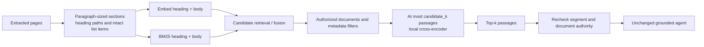

# Section-aware retrieval

This is an opt-in retrieval change. Generation prompts, answer contracts, model choice, and existing acceptance thresholds are unchanged. The unanswerable-abstention safety gate now also requires ≥0.9.

## Configuration

1. Install the updated backend requirements, then run `.venv/bin/python -m scripts.install_reranker` from the repository root. This explicitly downloads about 24 MB of pinned ONNX/tokenizer assets into ignored `.data/reranker`. `KB_RERANKER_DIR` overrides that directory and must be identical for the installer and search service.
2. In knowledge-base configuration select `chunking: section`, retain the desired character size/overlap, and rebuild. Existing immutable versions retain their original chunks until the new version publishes.
3. In KB search defaults or Retrieve/Query customization select `reranker: local_cross_encoder` and `candidate_k: 50`. Existing saved workflows with an explicit pool of 20 retain that setting; new configurations default to 50.

The reranker uses [MS MARCO MiniLM](https://huggingface.co/cross-encoder/ms-marco-MiniLM-L6-v2) through its [ONNX export](https://huggingface.co/Xenova/ms-marco-MiniLM-L-6-v2), pinned at revision `a09144355adeed5f58c8ed011d209bf8ee5a1fec`. This is a separate retrieval scorer, not a replacement for the generation or embedding model. No network/model downloads occur during ranking; missing assets fail actionably. Restart the search service after replacing model assets because loaded sessions are cached.

## Flow and limits



- `section` recognizes Markdown headings, numbered headings, section-sign regulatory headings, short title-case lines, and conservative inline noun-phrase headings. It carries headings across pages, removes repeated running headers, and groups short regulatory siblings under their common parent. It is heuristic text parsing, not a complete PDF-layout or legal-reference parser.
- Flattened regulatory text can make `(i)`, `(v)`, and `(x)` ambiguous between letters and Roman numerals. An alphabetic continuation such as `(h)` to `(i)` drops uncertain preceding ancestors, even if numbered children appeared in between. This deliberately loses some possible ancestry instead of asserting the preceding sibling's subject; original clause text is retained.
- Overlong paragraphs use the configured character window/overlap. Normal list items fitting the size budget remain intact. Parent/list context can still exceed that budget; heading metadata does not resolve every cross-reference.
- `heading_path` is stored separately in the search database. Returned passage text includes that path, so offline artifacts and the model see the same context. Legacy rows migrate to an empty path and retain their previous canonical evidence identity.
- Candidate pools are capped at 100; top-k remains capped at 20. Similarity, keyword, hybrid, and RRF all support reranking. Filters and the configured minimum **original retrieval score** apply before reranking. Returned `score` remains the original retrieval score; ordering after reranking therefore need not be descending by that field.
- The cross-encoder uses CPU inference in batches of eight with a 512-token pair budget; the question is limited to its first 128 tokens and the passage uses the remaining space. Long passages are truncated for scoring, while their original full text is returned. Scoring is serialized in a worker thread per process; concurrent requests can queue. No claim-support judgment is involved in retrieval ranking.

## Reproduce evaluations

```bash
# Original paragraph configuration with the prior 20-candidate pool
.venv/bin/python -m scripts.eval_retrieval --corpus evals/real --questions evals/real/questions.json --modes similarity,keyword,hybrid,rrf --chunking paragraph --candidate-k 20 --reranker none --generate llama3.1:latest --generate-mode hybrid --out evals/results/f11-baseline-repeat.json

# Section-aware candidate; generation settings are unchanged
.venv/bin/python -m scripts.eval_retrieval --corpus evals/real --questions evals/real/questions.json --modes similarity,keyword,hybrid,rrf --chunking section --candidate-k 50 --reranker local_cross_encoder --generate llama3.1:latest --generate-mode hybrid --out evals/results/f11-candidate-repeat.json
.venv/bin/python -m scripts.check_grounding_eval evals/results/f11-candidate-repeat.json

# Offline classifier experiment; the llama3.1 JSON judge is retired
.venv/bin/python -m scripts.install_nli --help
.venv/bin/python -m scripts.eval_nli --help
```

All generation artifacts now contain `passages` with citation, filename, page, text, retrieval `score`, and optional `rerank_score` for every retrieved source, including uncited distractors. Historical F11 files omitted scores; absence is not a zero measurement. New retrieval-only reports also preserve scored rows for unanswerable questions, without including them in answerable-recall denominators. Raw reranker logits are relevance scores, not calibrated probabilities of answer support.

The real corpus has an explicit `corpus-manifest.json` containing only its four source documents. Adjacent questions and annotation files cannot enter the retrieval index through the evaluation harness. The expanded safety suite is `evals/real/questions-expanded.json`; use `check_grounding_eval --expected-count 53` for its generation report. Exit codes are 0 accepted, 1 rejected, and 2 unusable input. The original 38-question count remains the default; metric thresholds are unchanged.

The 24-case calibration set contains assistant annotations with rationales and explicitly records that independent human review is pending. It includes the four prior batch failures and negative counterfactuals grounded in real excerpts. The old llama3.1 claim-judge CLI is retired. Its replacement [NLI experiment](nli-calibration.md) has valid classifications but poor semantic agreement, so it remains offline. Judge output remains outside the runtime and release gate.
